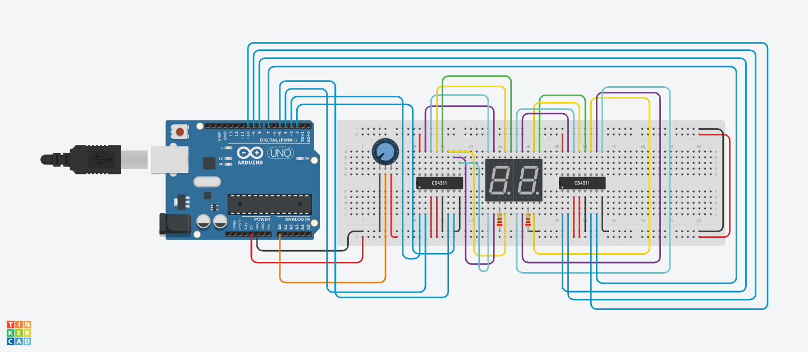

# R3 Software Task 1



TinkerCAD Link: https://www.tinkercad.com/things/fDojZ34f9yC
 
For this project I was tasked with using a potentiometer to display numbers 0-99 on two 7-segment displays. Below are some key details about the project, and how they work.

- The 7-Segment Displays

7-Segment displays are relatively simple. They consist of 7 LEDs that when turned on in certain combinations can display digits 0-9, and letters A-F. If we were to simply connect each pin on the display to an output pin on the Arduino, it would work fine but we would quickly run out of pins, especially in the case of this project where two 7-segment displays are required. This leads to the next key component.

- The CD4511 Decoder

The CD4511 is a *BCD* to 7-segment decoder. BCD is an acrynom for Binary-Coded Decimal, which is the input the CD4511 accepts and uses to turn on the corresponding segments of a 7-segment display. This decoder is useful as it allows us to significantly reduce the number of pins we need to occupy on the Arduino. To control 2 CD4511 decoders, only 8 pins are needed, compared to the 14 that would be required if we connected each 7-segment display directly. 

- The Potentiometer

The potentiometer is another simple component that works by varying in resistance as the knob is turned. This creates a versatile input device with a variety of possible input values.

- The Code

I began by naming all the pins used for each decoder, and assigning them to the pins they were connected to on the Arduino. Decoder 1 pins were named a1, a2, etc, while Decoder 2 pins were named b1, b2, etc. This made it much easier to reference these pins later and overall created more readable code.

Next I created two functions: *display1* and *display2*. These functions were used to convert the number input from the potentiometer (0-99) to binary for the decoder to display the proper number on the 7-segment display. The two functions are nearly identical, only difference being *display1* references the 'a' pins and *display2* references the 'b' pins.  

An example of one of the if statements from *display1*:
```
if(num == 5) { // 0101
    digitalWrite(a1, HIGH);
    digitalWrite(a2, LOW);
    digitalWrite(a3, HIGH);
    digitalWrite(a4, LOW);
  }
```
Each pin on the decoder represents a binary "place value". 

Perhaps the greatest challenge of this task was figuring out how to display 2 digit numbers across 2 seperate 7-segment displays. This was accomplished by creating 3 variables: *n*, *digit1*, and *digit2*. 

*n* stores the value from the potentiometer, *digit1* stores the value for the first display, which acts as the "tens column", and *digit2* stores the value for the second display, which acts as the "ones column". Later on in the loop, I divide *n* by 10, to store the "tens" value of *n* in *digit1*. Since *digit1* is an int, it can only store whole numbers, and anything after the decimal will be ignored. This is advantageous in this situation. 
I then modulus divide *n* by 10 to store the "ones" value of *n* in *digit2*. This works by taking the remainder of *n*/10. 

```
digit1 = n/10; 
digit2 = n%10;
```

After this, I call my *display1* and *display2* functions, passing them the values of *digit1* and *digit2* respectively. 

Another problem that needed to be solved was the output of the potentiometer. Just reading the pin the potentiometer was connected to with *analogRead()* resulted in values 0-1023. This of course is much too high for this project, so I used the *map()* function to map the values from 0-1023 to 0-99 as shown below:

```
int potValue = analogRead(A0);
int potMapped = map(potValue, 0, 1023, 0, 99);
```
This concludes the explanation for this task, overall a fun project and I'm excited to work on more! 